# Booking Movie Ticket System

<div align="center">


</div>

A comprehensive movie ticket booking system that allows users to browse movies, select seats, and book tickets online.

## 🌐 Live Demo

<div align="center">
  
### 🎬 **Experience the Live Application**

[](https://booking-movie-ticket-client-eight.vercel.app/)

---

*Click the button above to explore the complete movie booking experience*

</div>

## 📸 Application Visualization

### 🎭 User Interface

#### Home Page
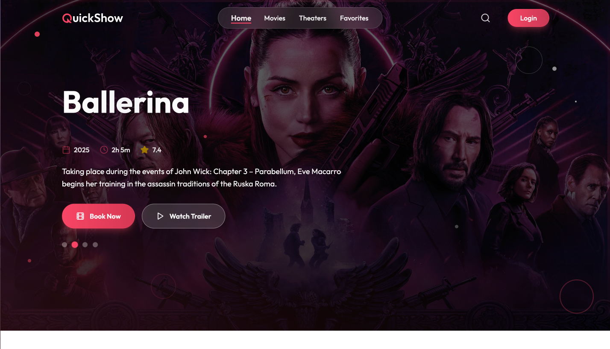
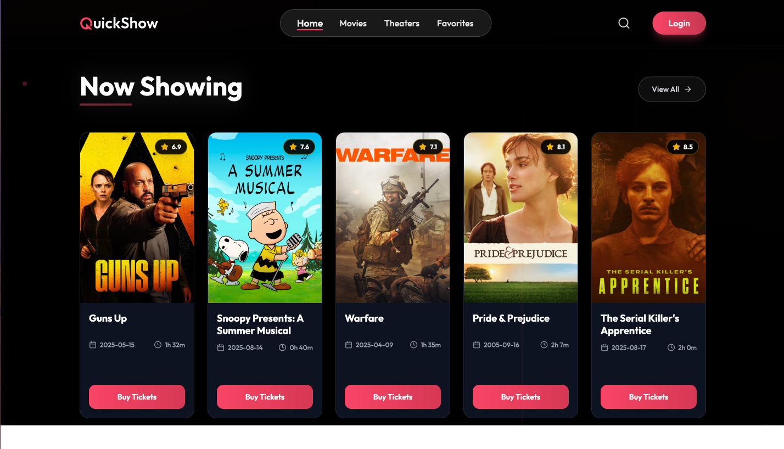
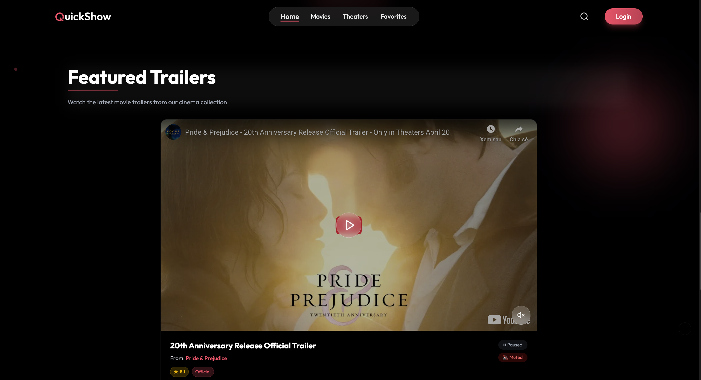

*Browse featured movies and upcoming releases*

#### Movie Details
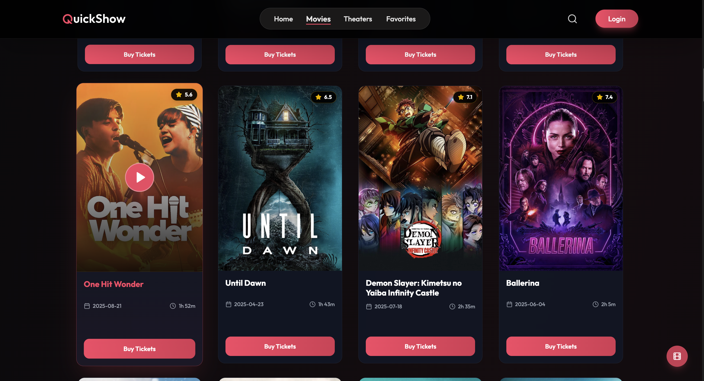

*View movie information, trailers, and available showtimes*

#### Seat Selection
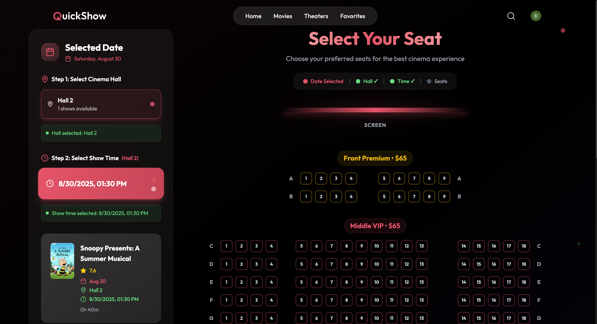

*Interactive seat map with real-time availability*

#### Booking History
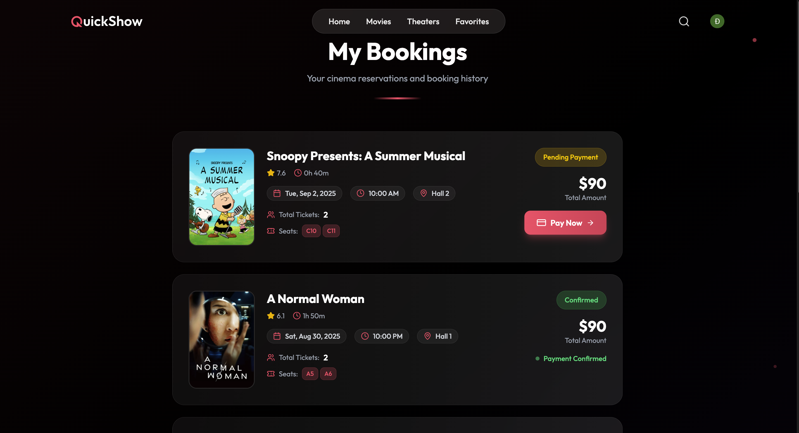

*Client Booking*

#### User Profile
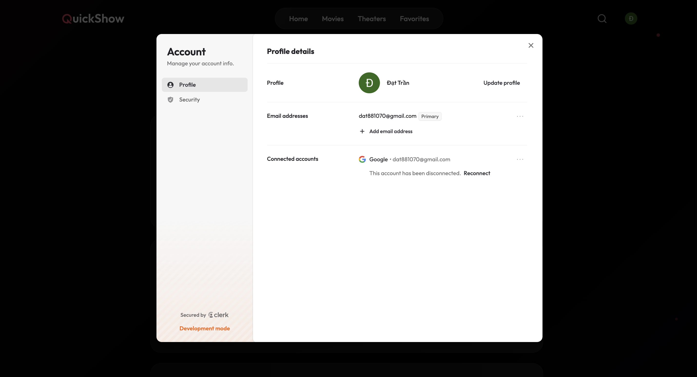

*Manage user account*

### 🛠️ Admin Dashboard

#### Admin Overview
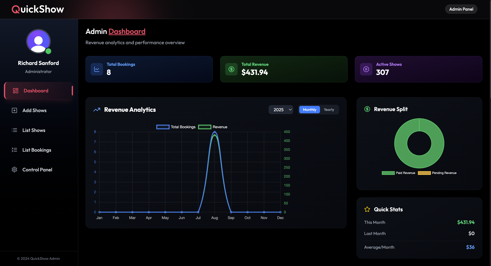
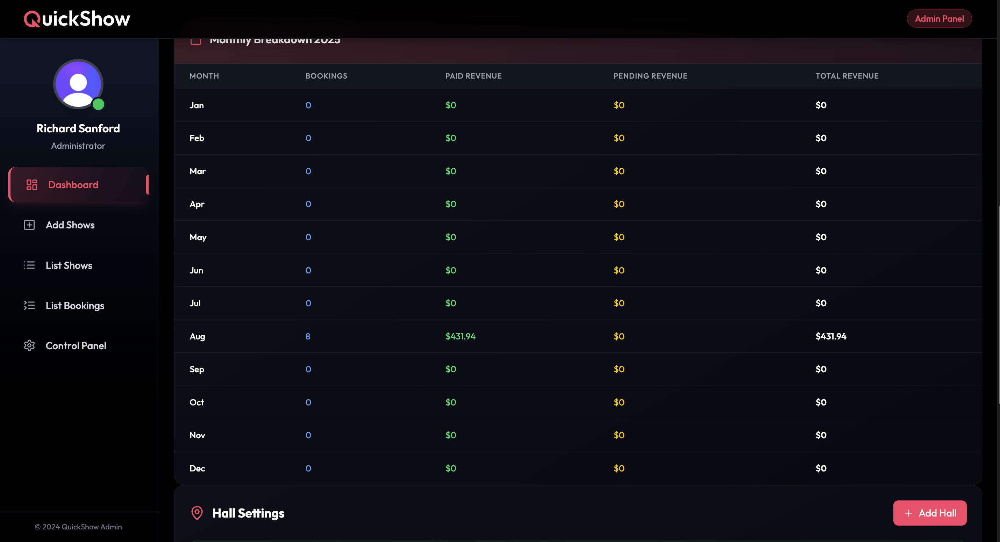

*Comprehensive dashboard with analytics and key metrics*

#### Movie Management
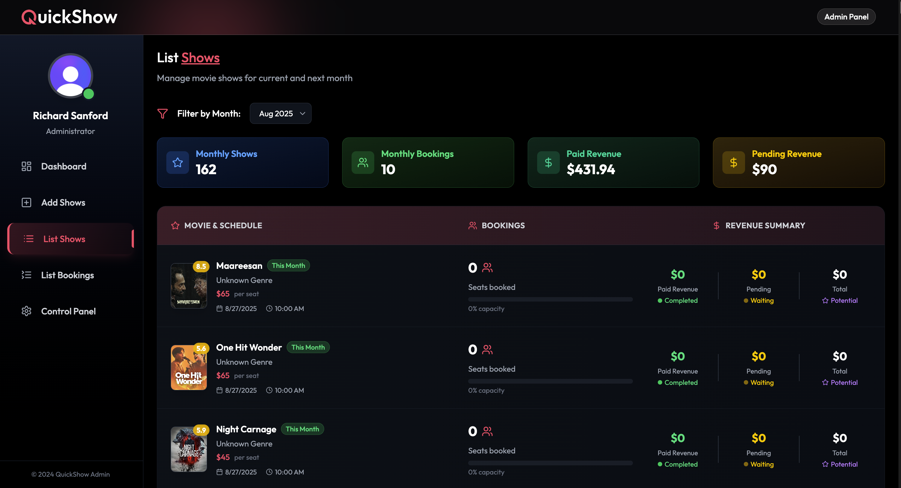

*Add, edit, and manage movie listings*

#### Theater Management
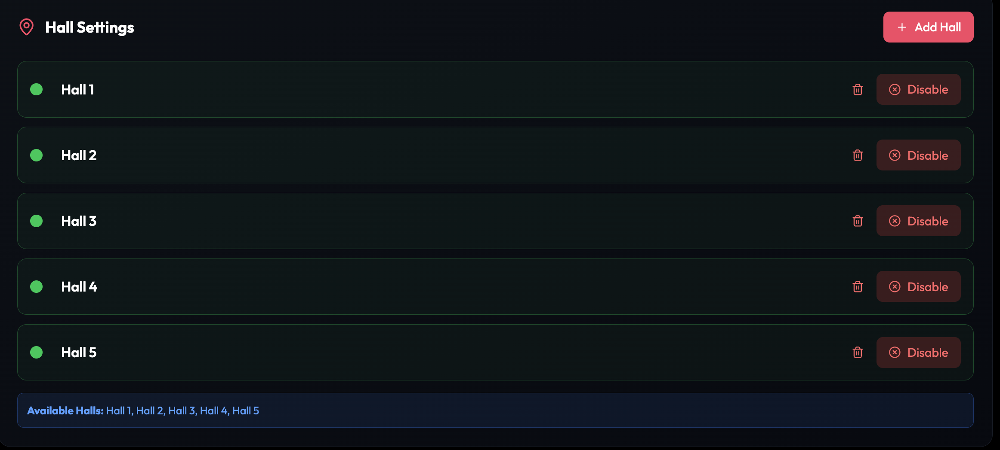

*Configure theaters, screens, and seating arrangements*

#### Booking Management
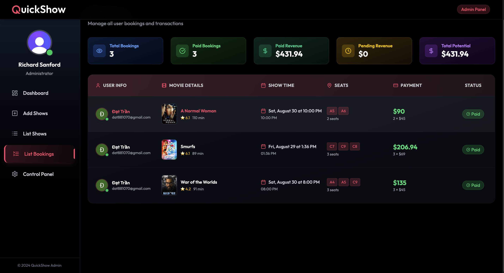

*Monitor and manage all customer bookings*

#### Control Panel
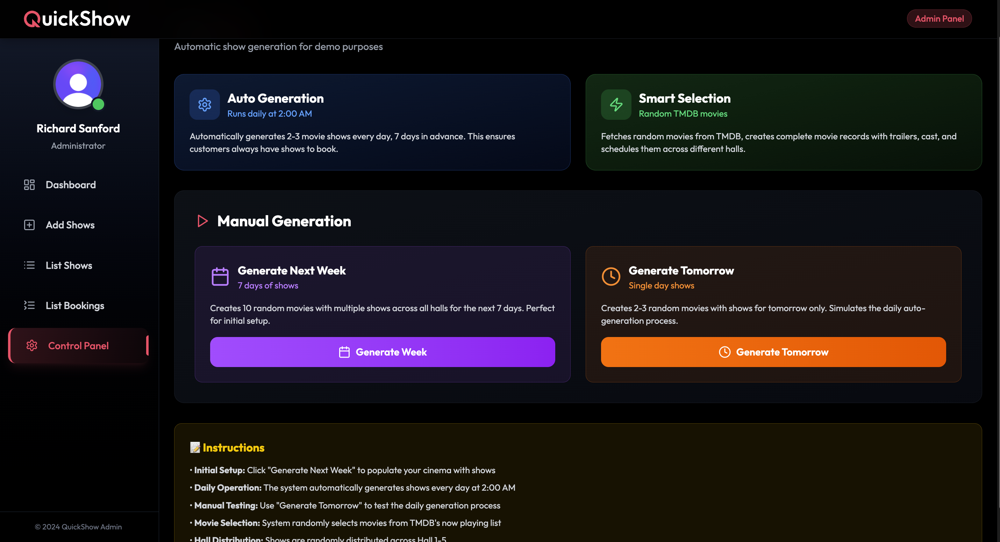

*Add show automation*

## ✨ Features

- **User Authentication**: Registration, login, and profile management via Clerk
- **Movie Browsing**: View current and upcoming movies with details
- **Theater Management**: Multiple theaters and showtimes
- **Seat Selection**: Interactive seat map with real-time availability
- **Booking System**: Complete ticket booking workflow
- **Payment Integration**: Secure payment processing with Stripe
- **Admin Dashboard**: Movie and theater management for administrators
- **Background Jobs**: Automated tasks with Inngest
- **Email Notifications**: Booking confirmations via Nodemailer
- **Responsive Design**: Works on desktop and mobile devices

## 🛠️ Technology Stack

### Frontend


- **Framework**: React 19 with Vite
- **Styling**: Tailwind CSS 
- **Authentication**: Clerk React
- **Routing**: React Router DOM 
- **HTTP Client**: Axios
- **Charts**: Chart.js with React Chart.js 2
- **Icons**: Lucide React
- **Video Player**: React Player
- **Notifications**: React Hot Toast

### Backend


- **Runtime**: Node.js with Express
- **Database**: MongoDB with Mongoose 
- **Authentication**: Clerk Express
- **Payment**: Stripe 
- **Background Jobs**: Inngest
- **Email**: Nodemailer 
- **File Upload**: Cloudinary 
- **Task Scheduling**: Node-cron 
- **Webhooks**: Svix 
- **CORS**: Enabled for cross-origin requests

### Services & Integrations


### Development Tools


## Deployment

### Frontend (Vercel)
- Automatic deployment from Git repository
- Environment variables configured in Vercel dashboard

### Backend
- Can be deployed on various platforms (Railway, Render, etc.)
- MongoDB Atlas for production database
- Webhook endpoints configured for Stripe and Inngest

### Development Tools
- **Package Manager**: npm
- **Dev Server**: Vite (Frontend), Nodemon (Backend)
- **Linting**: ESLint
- **Environment**: dotenv for environment variables

## 🚀 Installation

### Prerequisites
- Node.js (v18 or higher)
- MongoDB Atlas account or local MongoDB
- Clerk account for authentication
- Stripe account for payments
- Cloudinary account for file uploads

### Setup Instructions

1. **Clone the repository**
   ```bash
   git clone https://github.com/username/Booking_Movie_Ticket.git
   cd Booking_Movie_Ticket
   ```

2. **Install backend dependencies**
   ```bash
   cd server
   npm install
   ```

3. **Install frontend dependencies**
   ```bash
   cd ../client
   npm install
   ```

4. **Environment Configuration**
   Create a `.env` file in the server directory:
   ```env
   PORT=3000
   MONGODB_URI=your_mongodb_connection_string
   CLERK_SECRET_KEY=your_clerk_secret_key
   STRIPE_SECRET_KEY=your_stripe_secret_key
   STRIPE_WEBHOOK_SECRET=your_stripe_webhook_secret
   CLOUDINARY_CLOUD_NAME=your_cloudinary_cloud_name
   CLOUDINARY_API_KEY=your_cloudinary_api_key
   CLOUDINARY_API_SECRET=your_cloudinary_api_secret
   INNGEST_EVENT_KEY=your_inngest_event_key
   EMAIL_USER=your_email_address
   EMAIL_PASS=your_email_password
   ```

   Create a `.env.local` file in the client directory:
   ```env
   VITE_CLERK_PUBLISHABLE_KEY=your_clerk_publishable_key
   VITE_API_URL=http://localhost:3000/api
   ```

5. **Start the application**
   ```bash
   # Start backend server (from server directory)
   npm run server

   # Start frontend (from client directory, in another terminal)
   npm run dev
   ```

## 📱 Usage

### For Users
1. **Register/Login**: Create an account or login with Clerk authentication
2. **Browse Movies**: View available movies with showtimes
3. **Select Seats**: Choose preferred seats from the interactive seat map
4. **Make Payment**: Complete booking with Stripe secure payment
5. **Get Tickets**: Receive booking confirmation via email

### For Administrators
1. **Dashboard Access**: Login with admin credentials via Clerk
2. **Movie Management**: Add, edit, or remove movies
3. **Theater Management**: Manage theaters and seating arrangements
4. **Booking Overview**: View and manage all bookings with charts
5. **User Management**: Handle user accounts and permissions

## 📡 API Endpoints

### Shows
- `GET /api/show` - Get all shows
- `POST /api/show` - Create new show (Admin)
- `PUT /api/show/:id` - Update show (Admin)
- `DELETE /api/show/:id` - Delete show (Admin)

### Bookings
- `GET /api/booking` - Get bookings
- `POST /api/booking` - Create new booking
- `GET /api/booking/:id` - Get booking details
- `PUT /api/booking/:id` - Update booking status

### Admin
- `GET /api/admin/dashboard` - Get admin dashboard data
- `GET /api/admin/bookings` - Get all bookings (Admin)
- `GET /api/admin/users` - Get all users (Admin)
- `POST /api/admin/movies` - Add movie (Admin)

### User
- `GET /api/user/profile` - Get user profile
- `GET /api/user/bookings` - Get user bookings
- `PUT /api/user/profile` - Update user profile

### Webhooks
- `POST /api/stripe/webhook` - Stripe payment webhooks
- `POST /api/inngest` - Inngest background job webhooks

## 📂 Project Structure

```
Booking_Movie_Ticket/
├── client/                 # Frontend Vite + React application
│   ├── public/            # Static assets
│   ├── src/
│   │   ├── components/    # Reusable UI components
│   │   ├── pages/         # Page components
│   │   ├── context/       # React context providers
│   │   ├── lib/           # Utility libraries
│   │   └── main.jsx       # App entry point
│   ├── package.json       # Frontend dependencies
│   └── vite.config.js     # Vite configuration
├── server/                # Backend Node.js + Express application
│   ├── configs/           # Database and app configuration
│   ├── controllers/       # Route controllers
│   ├── models/            # Mongoose database models
│   ├── routes/            # Express API routes
│   ├── services/          # Business logic services
│   ├── inngest/           # Background job functions
│   ├── package.json       # Backend dependencies
│   └── server.js          # Server entry point
├── .env                   # Environment variables
└── README.md             # Project documentation
```

## 🗄️ Database Models

### Show Model
- Movie information, theater details, showtimes, and seat availability

### Booking Model
- User bookings with seat selections, payment status, and booking details

### User Model (Managed by Clerk)
- User authentication and profile data handled by Clerk

## ⚡ Background Jobs (Inngest)

- **Email Notifications**: Send booking confirmations
- **Seat Availability**: Update seat status
- **Payment Processing**: Handle payment confirmations
- **Data Cleanup**: Scheduled maintenance tasks

## 📧 Contact

- **Developer**: Dat Tran
- **Email**: dat881070@gmail.com
- **Project Link**: https://github.com/DatTran0509/Booking_Movie_Ticket

## 🙏 Acknowledgments

- Clerk for authentication services
- Stripe for payment processing
- Inngest for background job processing
- Cloudinary for image management
- MongoDB Atlas for database hosting
- Vercel for frontend deployment
