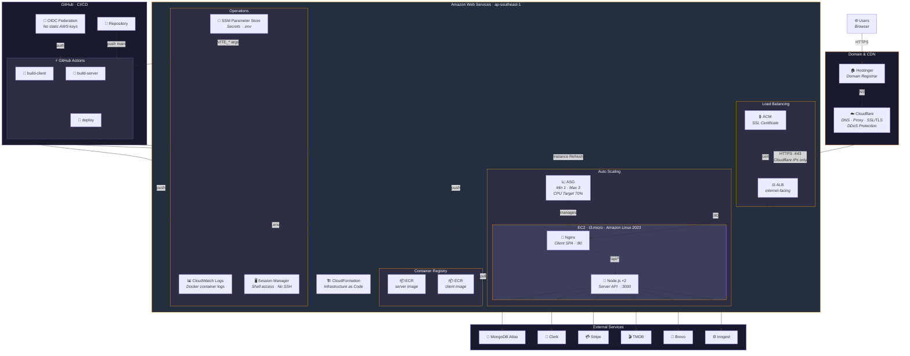
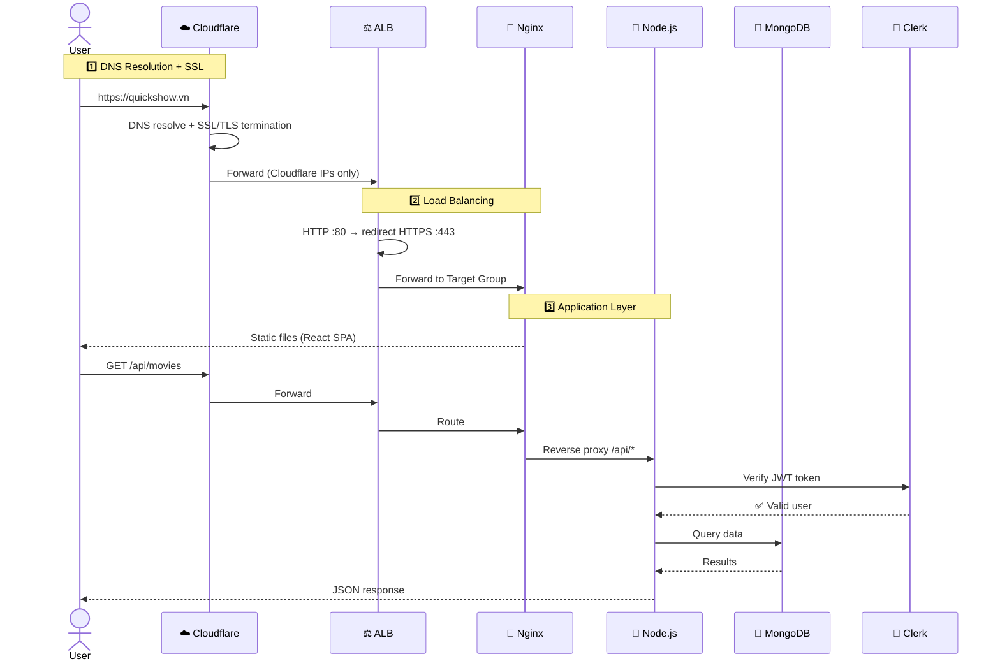
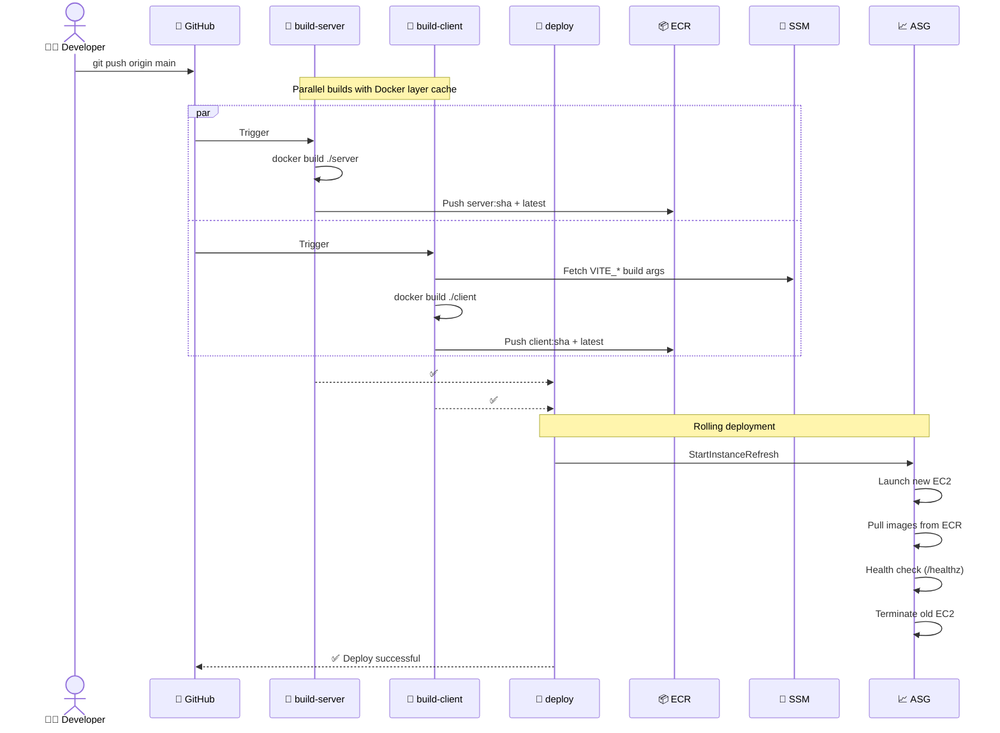
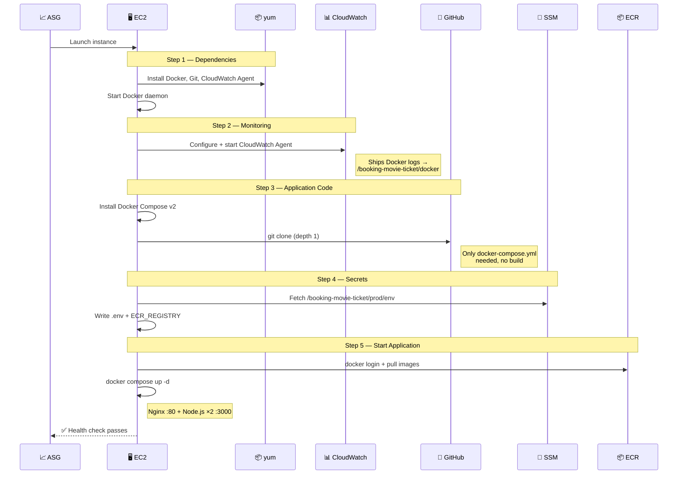

# ☁️ Cloud Architecture — Booking Movie Ticket

> Production infrastructure on AWS with automated CI/CD, monitoring, and multi-layer security.

---

## 🏗️ High-Level Architecture

---

## 🔄 Request Flow

Shows how a user request travels through the system:

---

## ⚡ CI/CD Pipeline

Automated build and deploy on every push to `main`:

---

## 🐳 EC2 Bootstrap (User Data)

What happens when a new EC2 instance launches:

---

## 🔒 Security Layers

```mermaid
graph LR
    subgraph L1["Layer 1 — Edge"]
        CF_WAF["☁️ Cloudflare<br/>DDoS · WAF · Rate Limit"]
    end

    subgraph L2["Layer 2 — Network"]
        PL["📋 Prefix List<br/>Cloudflare IPs only"]
        ALB_SG["🔒 ALB Security Group<br/>:80/:443 from Cloudflare"]
    end

    subgraph L3["Layer 3 — Compute"]
        EC2_SG["🔒 EC2 Security Group<br/>:80 from ALB only"]
        NO_SSH["🚫 No SSH port"]
        SSM_SH["🖥️ SSM Session Manager<br/>IAM-based shell access"]
    end

    subgraph L4["Layer 4 — Secrets & Auth"]
        SSM_S["🔐 SSM Parameter Store<br/>KMS encrypted"]
        IAM_R["🔑 IAM Roles<br/>Least privilege"]
        OIDC_F["🔑 OIDC Federation<br/>No static AWS keys"]
    end

    L1 -->|"filtered traffic"| L2
    L2 -->|"ALB only"| L3
    L3 -->|"IAM auth"| L4

    style L1 fill:#e74c3c,stroke:#c0392b,color:#fff
    style L2 fill:#e67e22,stroke:#d35400,color:#fff
    style L3 fill:#f39c12,stroke:#e67e22,color:#fff
    style L4 fill:#27ae60,stroke:#1e8449,color:#fff
```

---

## 📋 Services & Tools

| Category | Service | Role |
|----------|---------|------|
| **Domain** | Hostinger | Domain registrar |
| **CDN & Security** | Cloudflare | DNS, Proxy, SSL/TLS, DDoS Protection |
| **Load Balancer** | AWS ALB | HTTP→HTTPS redirect, traffic distribution |
| **Compute** | AWS EC2 (ASG) | t3.micro, Auto Scaling (1–3 instances) |
| **Containers** | Docker Compose | Nginx (client) + Node.js ×2 (server) |
| **Registry** | AWS ECR | Docker images, lifecycle policy (keep 5) |
| **Secrets** | AWS SSM Parameter Store | All environment variables (encrypted) |
| **SSL** | AWS ACM | Certificate for ALB HTTPS listener |
| **Logging** | AWS CloudWatch | Docker container logs |
| **Shell Access** | AWS SSM Session Manager | IAM-based access, no SSH |
| **IaC** | AWS CloudFormation | All AWS resource management |
| **CI/CD** | GitHub Actions | Build, push, deploy pipeline |
| **Auth** | AWS IAM + OIDC | Federated auth, no static keys |
| **Database** | MongoDB Atlas | Managed NoSQL database |
| **User Auth** | Clerk | User authentication & management |
| **Payments** | Stripe | Payment processing |
| **Movie Data** | TMDB API | Movie information source |
| **Email** | Brevo (SMTP) | Transactional emails |
| **Background Jobs** | Inngest | Async task processing |
